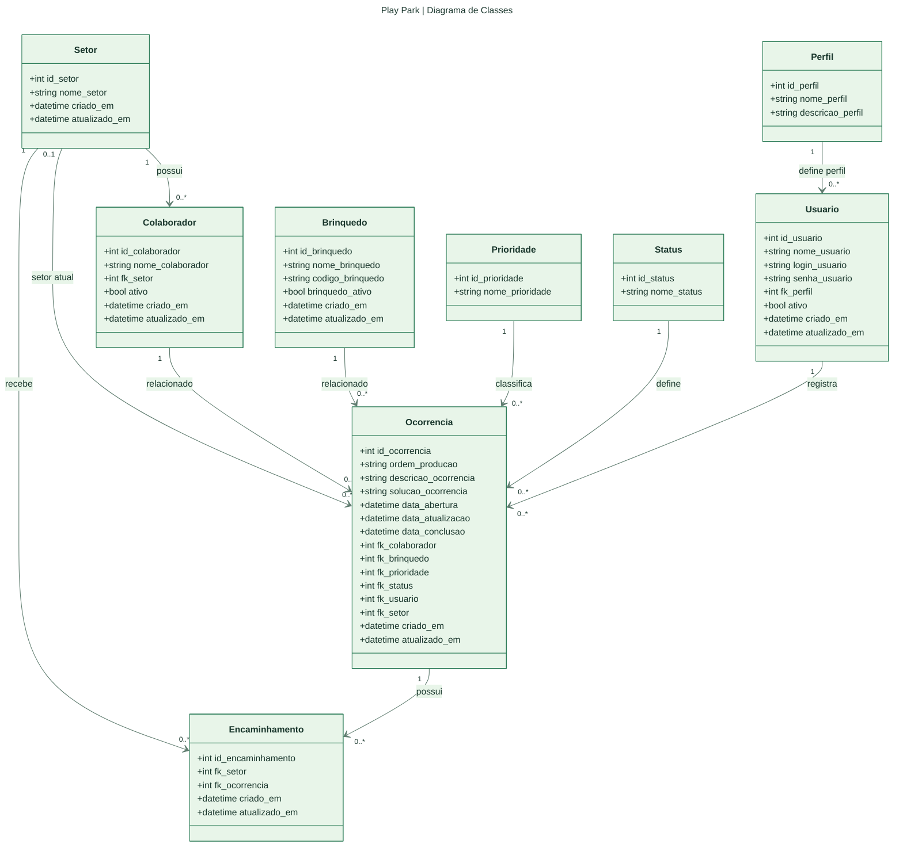
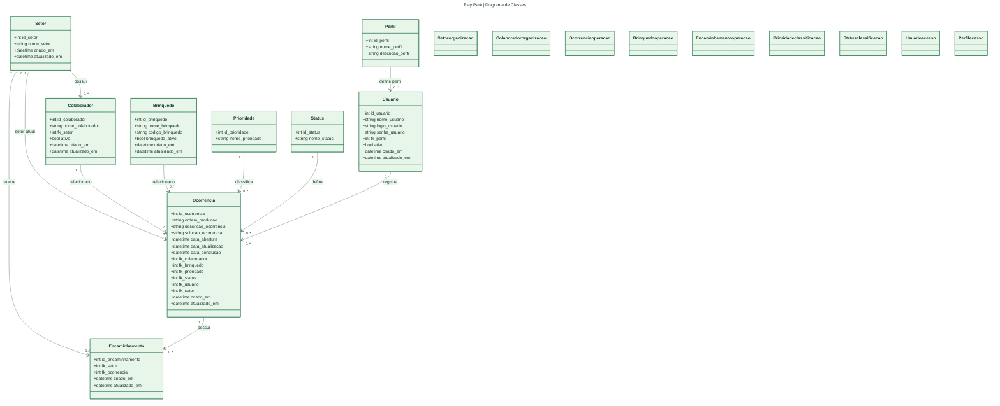

# Diagrama de Classes — Play Park


```mermaid
---
title: Play Park | Diagrama de Classes
config:
  theme: base
  themeVariables:
    fontFamily: Arial
    fontSize: 14px
    primaryColor: "#E8F5E9"
    primaryTextColor: "#18352B"
    primaryBorderColor: "#2E7D59"
    lineColor: "#607D70"
    background: "#FFFFFF"
    edgeLabelBackground: "#FFFFFF"
id: d76b0df1-d170-42db-800d-307f26d5c475
---
classDiagram
    direction TB

    class Setor {
        +int id_setor
        +string nome_setor
        +datetime criado_em
        +datetime atualizado_em
    }

    class Colaborador {
        +int id_colaborador
        +string nome_colaborador
        +int fk_setor
        +bool ativo
        +datetime criado_em
        +datetime atualizado_em
    }

    class Brinquedo {
        +int id_brinquedo
        +string nome_brinquedo
        +string codigo_brinquedo
        +bool brinquedo_ativo
        +datetime criado_em
        +datetime atualizado_em
    }

    class Ocorrencia {
        +int id_ocorrencia
        +string ordem_producao
        +string descricao_ocorrencia
        +string solucao_ocorrencia
        +datetime data_abertura
        +datetime data_atualizacao
        +datetime data_conclusao
        +int fk_colaborador
        +int fk_brinquedo
        +int fk_prioridade
        +int fk_status
        +int fk_usuario
        +int fk_setor
        +datetime criado_em
        +datetime atualizado_em
    }

    class Encaminhamento {
        +int id_encaminhamento
        +int fk_setor
        +int fk_ocorrencia
        +datetime criado_em
        +datetime atualizado_em
    }

    class Prioridade {
        +int id_prioridade
        +string nome_prioridade
    }

    class Status {
        +int id_status
        +string nome_status
    }

    class Usuario {
        +int id_usuario
        +string nome_usuario
        +string login_usuario
        +string senha_usuario
        +int fk_perfil
        +bool ativo
        +datetime criado_em
        +datetime atualizado_em
    }

    class Perfil {
        +int id_perfil
        +string nome_perfil
        +string descricao_perfil
    }

    %% Relacionamentos
    Setor "1" --> "0..*" Colaborador : possui
    Setor "0..1" --> "0..*" Ocorrencia : setor atual
    Setor "1" --> "0..*" Encaminhamento : recebe

    Colaborador "1" --> "0..*" Ocorrencia : relacionado
    Brinquedo "1" --> "0..*" Ocorrencia : relacionado
    Ocorrencia "1" --> "0..*" Encaminhamento : possui

    Prioridade "1" --> "0..*" Ocorrencia : classifica
    Status "1" --> "0..*" Ocorrencia : define

    Usuario "1" --> "0..*" Ocorrencia : registra
    Perfil "1" --> "0..*" Usuario : define perfil
```


```mermaid
---
title: Play Park | Diagrama de Classes
config:
  theme: base
  themeVariables:
    fontFamily: Arial
    fontSize: 14px
    primaryColor: "#E8F5E9"
    primaryTextColor: "#18352B"
    primaryBorderColor: "#2E7D59"
    lineColor: "#607D70"
    background: "#FFFFFF"
    edgeLabelBackground: "#FFFFFF"
---
classDiagram
    direction TB

    class Setor {
        +int id_setor
        +string nome_setor
        +datetime criado_em
        +datetime atualizado_em
    }

    class Colaborador {
        +int id_colaborador
        +string nome_colaborador
        +int fk_setor
        +bool ativo
        +datetime criado_em
        +datetime atualizado_em
    }

    class Brinquedo {
        +int id_brinquedo
        +string nome_brinquedo
        +string codigo_brinquedo
        +bool brinquedo_ativo
        +datetime criado_em
        +datetime atualizado_em
    }

    class Ocorrencia {
        +int id_ocorrencia
        +string ordem_producao
        +string descricao_ocorrencia
        +string solucao_ocorrencia
        +datetime data_abertura
        +datetime data_atualizacao
        +datetime data_conclusao
        +int fk_colaborador
        +int fk_brinquedo
        +int fk_prioridade
        +int fk_status
        +int fk_usuario
        +int fk_setor
        +datetime criado_em
        +datetime atualizado_em
    }

    class Encaminhamento {
        +int id_encaminhamento
        +int fk_setor
        +int fk_ocorrencia
        +datetime criado_em
        +datetime atualizado_em
    }

    class Prioridade {
        +int id_prioridade
        +string nome_prioridade
    }

    class Status {
        +int id_status
        +string nome_status
    }

    class Usuario {
        +int id_usuario
        +string nome_usuario
        +string login_usuario
        +string senha_usuario
        +int fk_perfil
        +bool ativo
        +datetime criado_em
        +datetime atualizado_em
    }

    class Perfil {
        +int id_perfil
        +string nome_perfil
        +string descricao_perfil
    }

    %% Relacionamentos
    Setor "1" --> "0..*" Colaborador : possui
    Setor "0..1" --> "0..*" Ocorrencia : setor atual
    Setor "1" --> "0..*" Encaminhamento : recebe

    Colaborador "1" --> "0..*" Ocorrencia : relacionado
    Brinquedo "1" --> "0..*" Ocorrencia : relacionado
    Ocorrencia "1" --> "0..*" Encaminhamento : possui

    Prioridade "1" --> "0..*" Ocorrencia : classifica
    Status "1" --> "0..*" Ocorrencia : define

    Usuario "1" --> "0..*" Ocorrencia : registra
    Perfil "1" --> "0..*" Usuario : define perfil

    %% Estilos visuais
    classDef organizacao fill:#E8F5E9,stroke:#2E7D59,color:#18352B,stroke-width:2px
    classDef operacao fill:#FFF3E0,stroke:#D97706,color:#633A0A,stroke-width:2px
    classDef classificacao fill:#E8EEF8,stroke:#4169A1,color:#1E3558,stroke-width:2px
    classDef acesso fill:#F0E8FA,stroke:#7952A9,color:#42245E,stroke-width:2px

    class Setor organizacao
    class Colaborador organizacao

    class Ocorrencia operacao
    class Brinquedo operacao
    class Encaminhamento operacao

    class Prioridade classificacao
    class Status classificacao

    class Usuario acesso
    class Perfil acesso
```

```
